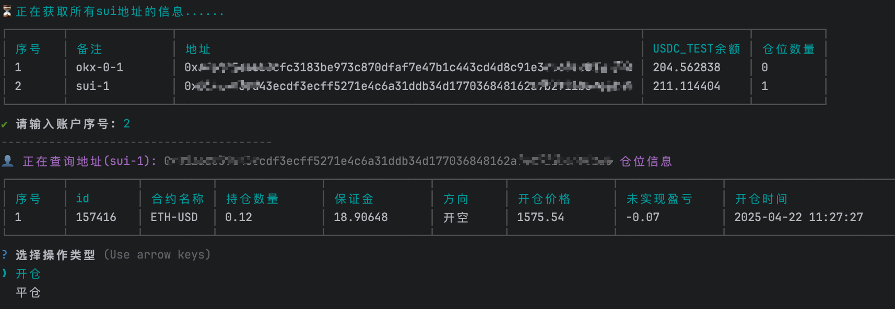

# ASTRO交易机器人

这是一个基于 Sui 网络上[Astro](https://beta.astros.ag/perp?referralCode=AYXOT2)测试网的自动化交易机器人，支持多账户管理和一键开关仓。

**更多脚本分享, 关注我的[X](https://x.com/0Xiaofan22921)**

## 预览


## 功能特点

- 🔄 支持多账户
- 💱 支持多种合约
- ⚡  一键开关仓

## 安装

1. 克隆项目
```bash
git clone https://github.com/fcmfcm1999/astro-testnet.git
cd astro-testnet
```

2. 安装依赖
```bash
npm install
```

## 配置

在 `src/data/config.json` 中配置您的账户信息：

```json
[
    {
      "nickname": "Sui地址的备注, 例如: Sui小号",
      "suiPrivateKey": "你的私钥",
      "proxy": "username:password@ip:port"
    }
]
```

在`.env` 文件中配置你的邀请码信息:
```
INVITE_CODE=AYXOT2
```

## 使用方法

1. 启动交易
```bash
node src/index.js
```


## 注意事项

- 请妥善保管私钥信息

## 免责声明

本项目仅供学习研究使用，使用本项目产生的任何风险由使用者自行承担。 